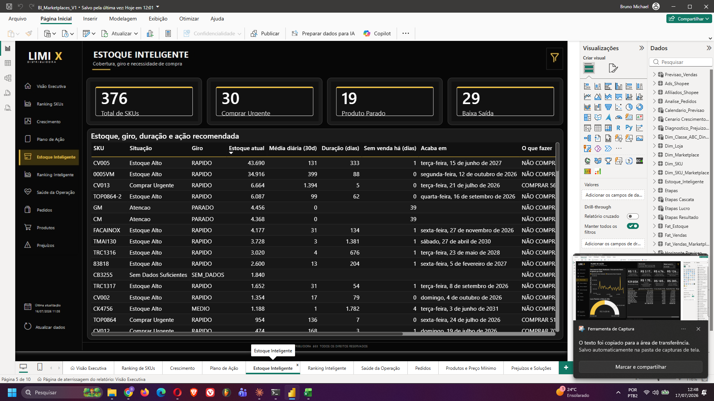
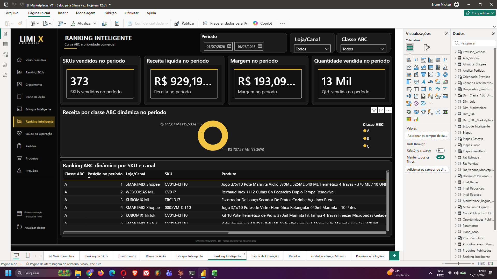
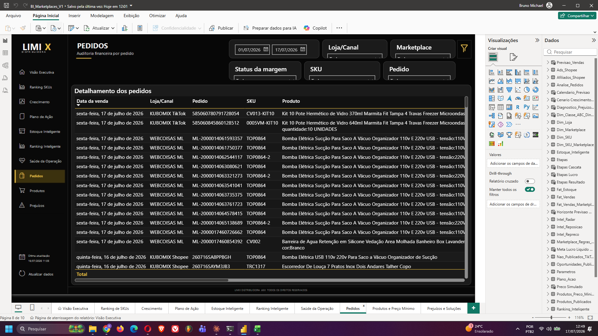
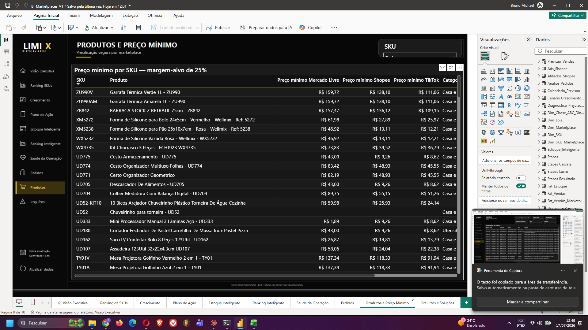
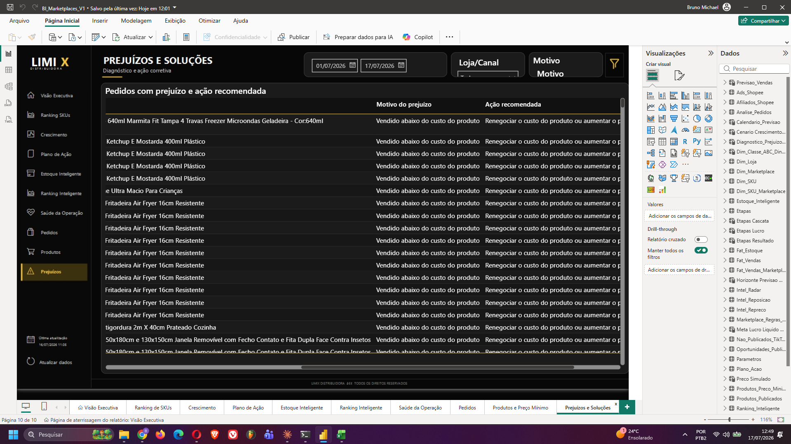
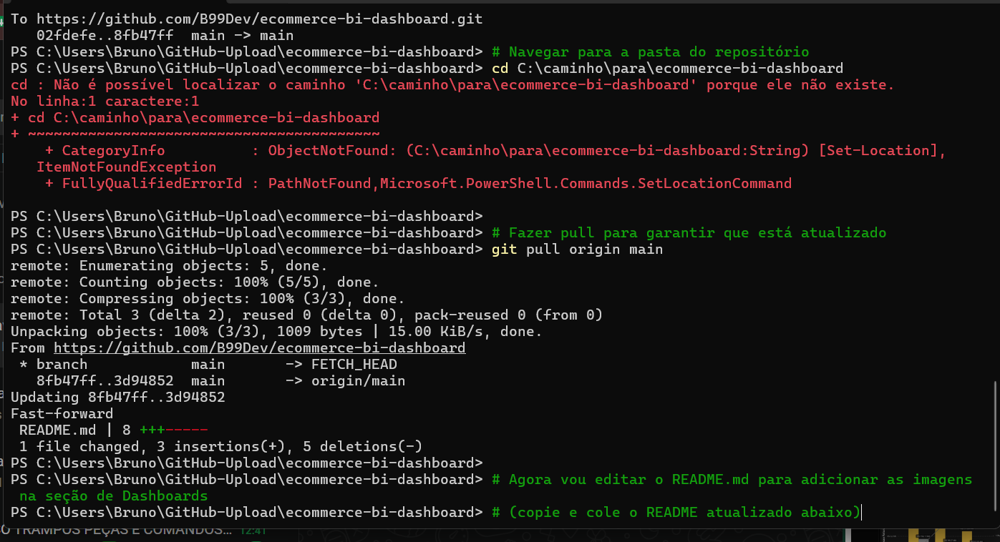

# 📊 E-Commerce BI Dashboard

Dashboard de Business Intelligence para análise de vendas, lucratividade e performance de e-commerce.

## 🎯 Funcionalidades
- Modelagem Star Schema (4 dimensões + 1 fato)
- 20+ medidas DAX documentadas
- 5 views analíticas SQL
- KPIs de vendas e margem
- Análise de inventário
- Performance por marketplace

## 📁 Estrutura
\\\
├── sql/
│   └── schema.sql          (300+ linhas)
├── dataset/
├── docs/
├── CHANGELOG.md
├── ROADMAP.md
└── LICENSE
\\\

## 🚀 Roadmap
- Q3 2026: MVP ✅
- Q4 2026: Inteligência (previsões)
- Q1 2027: Automação (alertas)
- Q2 2027: Expansão (mobile)

## 📊 Dashboards

### 1️⃣ Visão Executiva
Painel principal com KPIs estratégicos: faturamento total, lucro, margem, ticket médio e performance por marketplace.

---

### 2️⃣ Ranking de SKUs
Análise detalhada de produtos: detalhamento por SKU/canal, margem por produto e receita líquida, com dados granulares.

---

### 3️⃣ Crescimento
Evolução mensal e semanal: receita, margem e lucro com variações percentuais e análise de tendências.

---

### 4️⃣ Plano de Ação
Previsões, metas de faturamento e acompanhamento de lucro previsto vs realizado.

---

### 5️⃣ Estoque Inteligente
Cobertura, giro e necessidade de compra com recomendações automáticas por SKU.

---

### 6️⃣ Ranking Inteligente
Curva ABC dinâmica com análise de prioridade comercial e performance.

---

### 7️⃣ Saúde da Operação
Riscos, oportunidades e indicadores consolidados de saúde operacional.

## 📝 License
MIT

**Criado em:** 17 de Julho de 2026
